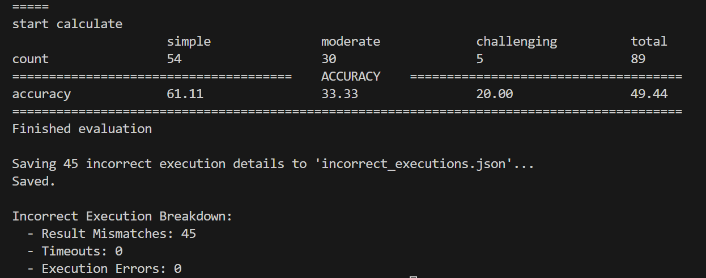
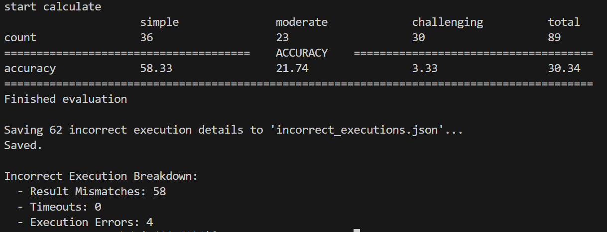
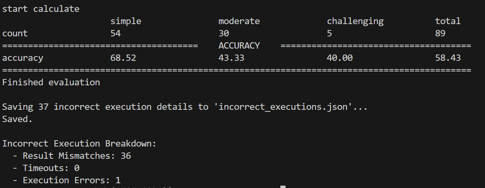

## evaluate 参数设置
python evaluate\exec_evaluate\evaluation.py --db_name card_games --eval_dir evaluate\exec_evaluate\output_golden_link_card_games_20251219_150813\ 

## 2025_12_17 gpt-5结果

## 2025_12_17 qwen3-max 结果（dev_20251106.json）

## 2025_12_17 qwen3-max 结果（golden_link_dev_20251106.json）

## 2025_12_17 qwen3-max结果

## 2025_12_17 qwen3-max 结果（golden_link.json）

加入自纠正：

## 2025_12_17 qwen3-max 结果（golden_link_financial.json）
